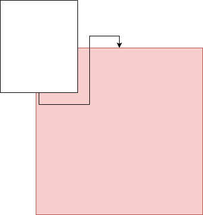

# Design thoughts

(nb: there is also lots of design stuff in README.md and spanner.sdl)

Two layers:

 * Verifiable log service: transparently timestamp and track independent log entries at scale
 * Verifiable chain service: transparently track small _serialized_ groups of log entries with expiry
 * Transaction protocol: construct a transaction by building a chain with votes

Log entries that are part of the same chain MUST be well ordered. Log entries that are part of different chains may be lazily ordered. As a result, the log service need not guarantee strict global (external) ordering.

> Intuition: if a group of participants begins two separate transactions, this starts two serialized but independent chains. As a result, one cannot offer any guarantees about which transaction completed first. In particular, the second transaction cannot depend on the resolution or expiry of the first transaction. If this dependency exists, the clients must include them as part of the same chain.

Log service data model:

  + Chain ID (specified by client or randomly generated by server)
    + Data hash (hash of data provided by client when creating record and server-generated salt)
    + Timestamp
    + Record ID (hash of full record including chain ID, and chain predecessor)

For a new Chain ID, no predecessor is used and the timestamp can be locally determined (no ordering guarantees for a new chain relative to other records). Subsequent records are added to a new chain transactionally, with a timestamp that is also locally-determined, but must be greater than the timestamp of the previous record).

Records can be lazily formed into a Merkle tree for verification. Merklization provides ordering only within chains. Merklization may place into the Merkle tree two records in different chains in the "wrong" order (violating timestamp order). Merklization MUST place any two records in the same chain in the "right" order (respecting timestamp order). This property is auditable in the log.

Records within a chain are externally consistent. No guarantees are provided for records between chains. Specifically, records between chains may be seen to appear in the wrong order in the log. For example, if a client creates record A in its own chain, waits for that operation to return success, and then creates record B in its own chain, it may be the case that record B appears in the log before record A. If the client wanted to depend on an ordering between the records, it must use the same chain.

> Is this a log-backed verifiable map? Key: ChainID, Value: full document, History: past versions of document and their timestamps. Maybe with a special AppendAtEnd operation rather than full Read-Modify-Write transactions.

> Log entries need to be (globally) chained in order to verify the timestamps are monotonic. This is distinct from the (local) chaining inherent to building out a transaction record. In other words, verifying timestamps is equivalent to building a massive single global chain. This is the root of the scalability problem.

