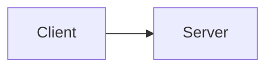
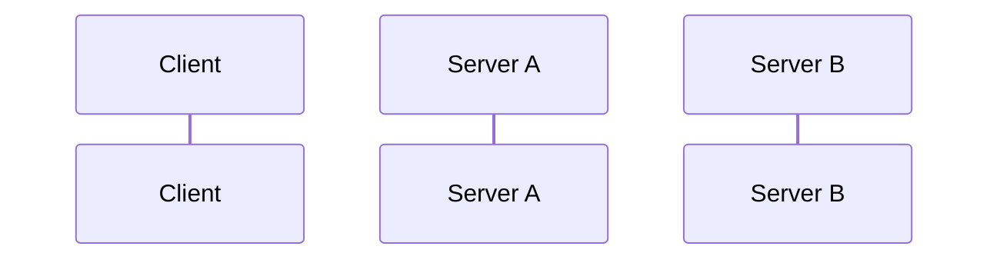

# `COMMIT`

This repo contains a proposal for `COMMIT`, a new HTTP verb with associated protocols and infrastructure for globally-consistent multi-party distributed systems.

See [Motivation](docs/motivation.md) for more details.

## Open questions

 * Do all servers obtain their own timestamps?
   * Can they instead provide a secret to the client after acquiring locks, client gets timestamp with signatures signed by oracle, provides signed timestamp back to servers
   * Adds one blocking request from client to time servers
   * As opposed to one blocking request from slowest server to time servers
   * Maybe the user's latency should govern the user's performance (but limits ability for servers to improve performance for users)
   * Option?

## Summary

`COMMIT` is a protocol for multiparty globally-ordered transactions.

For example, the client may inquire as to the balance in its account at BankA:

```http
GET /accounts/clientId/balance HTTP/1.1
Host: BankA.com
Consistent-Id: e919bb203@clientId
Consistent-Type: optimistic
```

The `Consistent-`* headers indicate to the server that this request is part of a transaction with the client-generated ID provided. The client is requesting optimistic concurrency, which means the server will not acquire locks or prevent modification to related data while the transaction proceeds.

The server may respond:

```http
HTTP/1.1 200 OK
Host: BankA.com
Content-Type: application/json
Content-Length: 46
Consistent-Timestamp: 1565122116462728412

{
    "balance": 100,
    "currency": "USD",
}
```

The server provides data for the requested resource in an application-defined format, accurate as of the provided `Consistent-Timestamp`.

Subsequently, the client may make separate requests to two different servers, BankA.com and BankB.com to update balances.

```http
PUT /accounts/clientId/transactions HTTP/1.1
Host: BankA.com
Content-Type: application/json
Content-Length: 57
Consistent-Id: e919bb203@clientId
Consistent-Type: optimistic

{
    "amount": -10,
    "payee": "clientId@BankB.com",
}
```

```http
HTTP/1.1 200 OK
Host: BankA.com
```

```http
PUT /accounts/clientId/transactions HTTP/1.1
Host: BankB.com
Content-Type: application/json
Content-Length: 56
Consistent-Id: e919bb203@clientId
Consistent-Type: optimistic

{
    "amount": 10,
    "payee": "clientId@BankA.com",
}
```

```http
HTTP/1.1 200 OK
Host: BankB.com
```

At this point, the client has transactionally inquired as to their balance at BankA, and enqueued a transfer of 10 dollars from their account at Bank A to their account at Bank B.

The client now issues a `COMMIT` message to complete the transaction.

```http
COMMIT /.well-known/consistent-id/e919bb203@clientId
Host: BankA.com
```

At this point Bank A:

 * Acquires locks on resources that were read or written during the transaction
   * If the server cannot acquire any needed locks within some server-defined timeout, the transaction fails
 * Validates that no intervening transactions have altered locked data since the earlier requests
   * If this were a pessimistic transaction, Bank A would instead have acquired locks during each of the earlier request, lessening the chance of a conflict.
 * Determine a timestamp 
 *  (since we started this transaction with optimistic concurrency control), validated that no data has changed (the account balance requested at the start of the transaction) and Bank A has accepted the transaction and provided a timestamp at which it thinks the transaction can commit. At this point, Bank A is promising not to accept anty 

```http
HTTP/1.1 202 Accepted
Host: BankA.com
Consistent-Timestamp: 1565122116462728694
```


```http
COMMIT /.well-known/consistent-id/e919bb203@clientId
Host: BankB.com
```


```http
Content-Type: application/json; charset=utf-8

```

```http
UPDATE /resource HTTP/1.1
Host: bankA.com
Consistent-Id: e919bb203@clientId

{
    "balance": 42,
}
```

The web is a standardized and open platform for client-server communication. Applications can consolidate their data into a single database (e.g. a social network), or across multiple pre-integrated databases in a single administrative domain (e.g. a payment network).

<!-- oeifjo we -->



Distributed applications refrain from consolidating data in a single administrative domain for safety, privacy, or other reasons. Supporting such applications in an open way, that is in a way that allows servers not previously acquainted with each other to cooperate, requires some additions to the HTTP protocol and related web infrastructure.



```mermaid
flowChart
    
```

test

```http
```