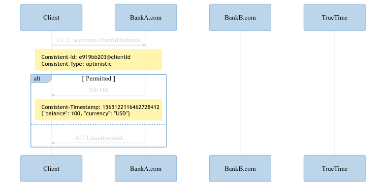
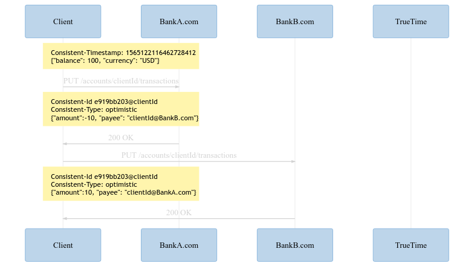
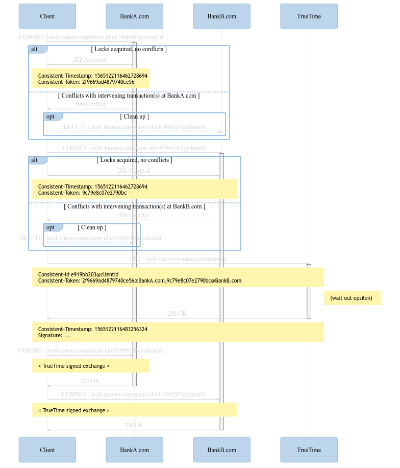

# `COMMIT`

This repo contains a proposal for `COMMIT`, a new HTTP verb with associated protocols and infrastructure for globally-consistent multi-party distributed systems.

See [Motivation](docs/motivation.md) for more details.

## Open questions

 * Do all servers obtain their own timestamps?
   * Can they instead provide a secret to the client after acquiring locks, client gets timestamp with signatures signed by oracle, provides signed timestamp back to servers
   * Adds one blocking request from client to time servers
   * As opposed to one blocking request from slowest server to time servers
   * Maybe the user's latency should govern the user's performance (but limits ability for servers to improve performance for users)
   * Option?

## Summary

`COMMIT` is a protocol for multiparty globally-ordered transactions. This section will walk through a simple example of a client that wants to check a bank balance and then commit a transaction transferring funds between two accounts at two servers. TrueTime infrastructure is also involved.

First the balance inquiry:



```http
GET /accounts/clientId/balance HTTP/1.1
Host: BankA.com
Consistent-Id: e919bb203@clientId
Consistent-Type: optimistic
```

The `Consistent-`* headers indicate to the server that this request is part of a transaction with the client-generated ID provided. The client is requesting optimistic concurrency, which means the server will not acquire locks or prevent modification to related data while the transaction proceeds (as opposed to pessimistic conccurency control in which the server acquires locks along the way).

If the server does not wish to proceed with the transaction as specified, it can refuse:

```http
HTTP/1.1 401 Unauthorized
Host: BankA.com
```

Otherwise the server responds with the requested information:

```http
HTTP/1.1 200 OK
Host: BankA.com
Content-Type: application/json
Content-Length: 46
Consistent-Timestamp: 1565122116462728412

{
    "balance": 100,
    "currency": "USD",
}
```

The server provides data for the requested resource in an application-defined format, accurate as of the provided `Consistent-Timestamp`.

The client can then manipulate the data on two servers.



```http
PUT /accounts/clientId/transactions HTTP/1.1
Host: BankA.com
Content-Type: application/json
Content-Length: 57
Consistent-Id: e919bb203@clientId
Consistent-Type: optimistic

{
    "amount": -10,
    "payee": "clientId@BankB.com",
}
```

```http
HTTP/1.1 200 OK
Host: BankA.com
```

```http
PUT /accounts/clientId/transactions HTTP/1.1
Host: BankB.com
Content-Type: application/json
Content-Length: 56
Consistent-Id: e919bb203@clientId
Consistent-Type: optimistic

{
    "amount": 10,
    "payee": "clientId@BankA.com",
}
```

```http
HTTP/1.1 200 OK
Host: BankB.com
```

At this point, the client has transactionally inquired as to their balance at BankA, and enqueued a transfer of 10 dollars from their account at Bank A to their account at Bank B.

The client now begins the commit process using the `COMMIT` verb:



```http
COMMIT /.well-known/consistent-id/e919bb203@clientId
Host: BankA.com
Content-Length: 0
```

At this point Bank A:

 * Acquires locks on resources that were read or written during the transaction
 * Validates that no intervening transactions have altered any of the data involved in the transaction since the earlier requests
 * Determine the timestamp of the last transaction to modify any of the data involved in the transaction

If the server fails to complete the above operations, the server can refuse the transaction with the appropriate error code (e.g. "408 Request Timeout" or "409 Confict").

```http
HTTP/1.1 409 Conflict
Host: BankA.com
```

Failures can occur for several reasons. If the server cannot acquire any of the needed locks within some server-defined timeout window, the server can fail the transaction (pessimistic concurrency control will reduce the likelihood of conflicts at the cost of performance, so servers should be careful in choosing whether and for which clients they will support it). If the client does not commit the transaction within some server-defined timeout window, the server can fail the transaction. If the server encounters any internal error, the server can fail the transaction.

If any participating server fails the transaction, the transaction is permanently invalidated. Upon discovering this failure, the client should inform other servers of the failure to release any acquired resources, especially if pessimistic concurrency was used.

```http
DELETE /.well-known/consistent-id/e919bb203@clientId
Host: BankB.com
```

Servers can also unilaterally invalidate uncommitted transactions after some server-defined timeout period.

If the server succeeds in validating the committability of the transaction, it will accept the transaction.

```http
HTTP/1.1 202 Accepted
Host: BankA.com
Consistent-Timestamp: 1565122116462728694
Consistent-Token: 2f9669ad4879740ce56
```

The timestamp provided by the server during transaction acceptance must be strictly greater than the timestamp of any transaction the server has committed that has touched the data invovled in the transaction. For example, if `/accounts/clientId/balance` was last modified on BankA.com by a transaction with timestamp ...693, then the server must respond with a new timestamp of ...694 or greater. Note that this is not (yet) the timestamp assigned to the transaction, only the timestamp reflecting the acceptance of this in-progress transaction. The `Consistent-Token` is a token is used below for ordering.

The client issues a similar request to all servers in the transaction.

```http
COMMIT /.well-known/consistent-id/e919bb203@clientId
Host: BankB.com
Content-Length: 0
```

```http
HTTP/1.1 202 Accepted
Host: BankB.com
Consistent-Timestamp: 1565122116476573521
Consistent-Token: 9c79e8c07e2790bc
```

Let us review the state of the system at this point:

 * The client has queried data from and enqueued a transaction at two different servers
 * BankA.com has confirmed that the balance data read above remains valid
 * BankA.com has confirmed that it holds locks such that conflicting modifications to the balance of the client's account at Bank A will not be made
 * BankB.com has confirmed that it holds locks such that conflicting modifications to the balance of the client's account at Bank B will not be made

The client now performs a commit wait with TrueTime:

```http
GET /.well-known/truetime/commitwait HTTP/1.1
Host: truetime.net
Consistent-Id: e919bb203@clientId
Consistent-Token: 2f9669ad4879740ce56@BankA.com; 9c79e8c07e2790bc@BankB.com
```
TrueTime will perform a commit wait and return a timestamp as part of a [signed exchange](https://wicg.github.io/webpackage/draft-yasskin-http-origin-signed-responses.html):

```http
HTTP/1.1 200 OK
Host: truetime.net
Consistent-Id: e919bb203@clientId
Consistent-Token: 2f9669ad4879740ce56@BankA.com;
9c79e8c07e2790bc@BankB.com
Consistent-Timestamp: 1565122116483256324
X-Consistent-Epsilon: 1238
Signature:
 sig1;
  sig=*MEUCIQDXlI2gN3RNBlgFiuRNFpZXcDIaUpX6HIEwcZEc0cZYLAIga9DsVOMM+g5YpwEBdGW3sS+bvnmAJJiSMwhuBdqp5UY=*;
  integrity="digest/mi-sha256";
  validity-url="https://truetime.net/resource.validity.1511128380";
  cert-url="https://truetime.net/oldcerts";
  cert-sha256=*W7uB969dFW3Mb5ZefPS9Tq5ZbH5iSmOILpjv2qEArmI=*;
  date=1511128380; expires=1511733180,
```

TrueTime guarantees that all requests for a timestamp that started after this call returned will produce timestamps strictly greater than the timestamp provided.

The client then provides this signed exchange to the servers:

```http
COMMIT /.well-known/consistent-id/e919bb203@clientId
Host: BankA.com
Content-Length: 553

<timestamp signed exchange>
```

```http
HTTP/1.1 200 OK
Host: BankA.com
```

```http
COMMIT /.well-known/consistent-id/e919bb203@clientId
Host: BankB.com
Content-Length: 553

<timestamp signed exchange>
```

```http
HTTP/1.1 200 OK
Host: BankB.com
```

The transaction is now committed and globally ordered.
